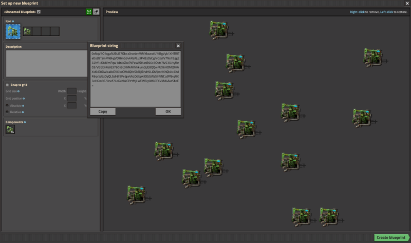
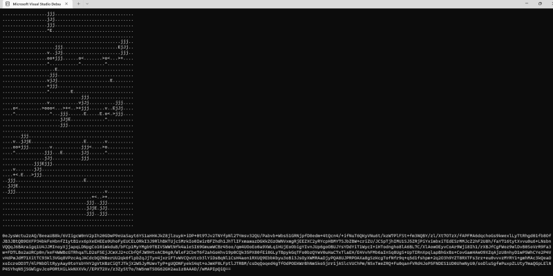
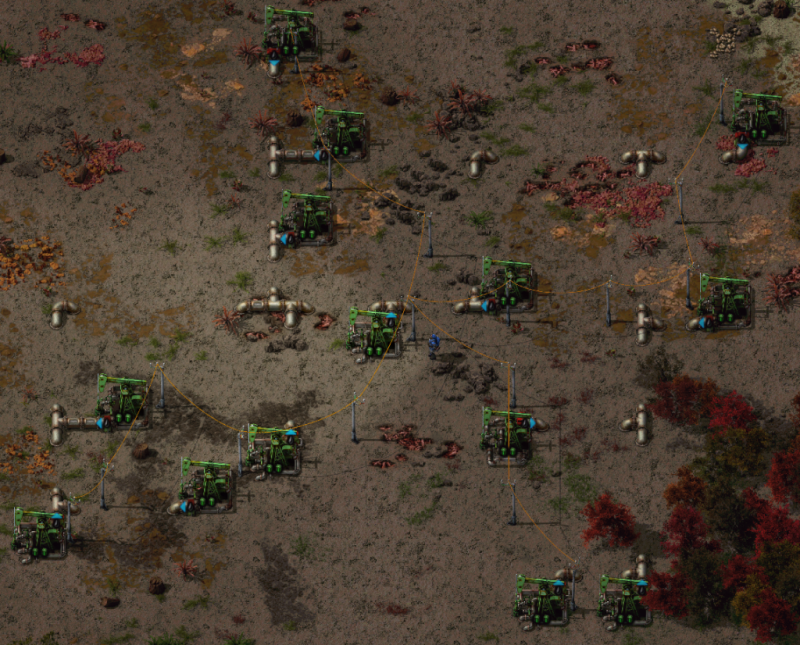

# FactorioTools

Custom tools to augment the play of Factorio by Joel Verhagen. Currently, there is only one tool: an **oil field (outpost) planner**.

## Oil field planner


Given a blueprint containing pumpjacks, this tool return output a new blueprint conecting the pumpjacks with pipes and
electric poles. It also tried to find the best direction for the pumpjack to minimize extra pipes.

If you've used [FBE's](https://fbe.teoxoy.com/) or [Autotorio's](https://www.autotorio.com/oil) oil outpost generator or read [DeeFox's post](https://www.reddit.com/r/factorio/comments/6all0k/after_those_blueprintwizardryposts_i_decided_to/), it's a lot like that.

Why did I build my own? Well, I didn't know of these tools before I started and by the time I was committed, I still hadn't learned about the sunk cost fallacy. But actually I was interested if I could make the State-of-the-Art planner that generates the very best plans! Well, I haven't 😂 (at least not all the time). But I have built a tool that is very configurable and tries several different planning strategies and returns the best results.

### Check it out

The tool is available here: https://factorio-tools.vercel.app/oil-field. There is an "Add sample" button (which drops one of my test blueprints in) and "View in FBE" buttons to view the input and output blueprints. Give it a try and let me know what you think!

I've also attached a video of the thing in action.

https://user-images.githubusercontent.com/94054/224560733-35ca401f-ae51-46a9-951b-78ecc511227e.mp4

### Features

- Given a blueprint containing ≥ 1 pumpjack, it makes a blueprint with pipes, beacons, and poles.
- It prefers the blueprint with the _most beacon effects_ (highest oil field output), then _fewest beacons_ (minimizing power consumption), then _fewest pipes_ (maximizing pipe throughput).
- It supports non-vanilla beacon settings and can avoid beacon overload (for Space Exploration).
- It supports non-vanilla electric pole settings.
- It's meant to have a fast user experience, so it plans quickly but also makes it easy to paste in BPs.
- It's a web app so it's easy to Alt + Tab from Factorio to your web browser with the tool open.
- Your preferred settings are saved so if you come back to the tool later, it remembers.
- You can save a blueprint and all settings into a shareable URL.

### You might want to use this tool if

- You want an optimal (or near optimal) layout for your oil outposts.
- You have non-vanilla beacon or electric pole settings.

### Methodology

I captured 57 test blueprints from my own saves and used them for a scoring data set. If the beacon or pipe planning algorithms I tried produced better results on this data set, I considered it a better algorithm and moved forward with the idea. This iterative process allowed me to come up with several algorithm variants that are all used.

I re-implemented FBE's pipe planner and beacon planner (with some tweaks) and wrote my own algorithms for pipe placement, pipe straitening, beacon placement, and electric pole placement. I did not try FBE's electric pole algorithm since it's not that important to have the fewest electric poles.

My pipe planning algorithm is called "connected centers". It first tries to find pumpjacks that should be directly connected with lines of pipes ("trunks") and then connects these groups incrementally. My best performing "connected centers" variant uses Dr. Chris C. N. Chu's FLUTE algorithm, which is used for rectilinear Steiner minimal tree generation (RSMT) problem. RSMT is an NP-hard problem so getting a truly optimal solution isn't very feasible especially when considering multiple parameters like pipes, beacons, and poles.

My beacon planning algorithm is called "snug" and it tries to place beacons as close to each other as possible after preferring starting locations that cover the most pumpjacks.

The tool tries up to 16 different planning routines and returns the best one to the user. Even for larger oil fields (20+ pumps) it generally completes in less than 100ms. The tool shows the quality of the other plans so you can see how each algorithm did.


### Ranking

For all of my test blueprints, I counted which series of algorithms (a "plan") yielded the best blueprint. If the plan was tied for first place, all ties share the win.


This shows that on my data set my "Connected Centers" pipe planner is the best the most often but FBE's beacon planner is dominant. The other algorithms are still valuable to keep in the app because they still yield the best plans sometimes (just not most often).

### Learning

This was a very interesting problem domain for me, and I learned a lot about front-end web development (Vue.js + Vite is great), .NET performance optimizations, algorithms (e.g. Delaunay triangulation, A* variants, Bresenham's line, etc), and hosting/deployment technologies. I also talked to the Factorio team over email about fair use of Factorio assets (which was ambiguous in their terms of service).

If you want to get your hands dirty with software development, I highly recommend finding a Factorio problem and writing a tool to help you.

### Credits

I want to thank [teoxoy](https://github.com/teoxoy), author of the awesome Factorio Blueprint Editor (FBE), for making their tool open source and talking to me on their Discord channel. I've tried to give credit to their algorithms that were re-implemented by me in both my tool and my source code. Their idea of using Delaunay triangulation for this space was AWESOME and really helped get my head in the right space.

### Screenshots







### Planner quality

| Electric pole        | Add beacons | Overlap beacons | Pipe count        | Pole count         | Beacon count      | Effect count       |
| -------------------- | ----------- | --------------- | ----------------- | ------------------ | ----------------- | ------------------ |
| small-electric-pole  | yes         | yes             | 46.39344262295082 | 34.131147540983605 | 80.81967213114754 | 110.14754098360656 |
| medium-electric-pole | yes         | yes             | 46.39344262295082 | 26.327868852459016 | 80.81967213114754 | 110.14754098360656 |
| substation           | yes         | yes             | 46.39344262295082 | 8.049180327868852  | 80.81967213114754 | 110.14754098360656 |
| big-electric-pole    | yes         | yes             | 49.75409836065574 | 35.278688524590166 | 77.04918032786885 | 106.24590163934427 |
| small-electric-pole  | yes         | no              | 44.68852459016394 | 14.229508196721312 | 6.19672131147541  | 11.80327868852459  |
| medium-electric-pole | yes         | no              | 44.68852459016394 | 11.60655737704918  | 6.19672131147541  | 11.80327868852459  |
| substation           | yes         | no              | 44.68852459016394 | 4.377049180327869  | 6.19672131147541  | 11.80327868852459  |
| big-electric-pole    | yes         | no              | 44.90163934426229 | 11.360655737704919 | 6.19672131147541  | 11.80327868852459  |
| small-electric-pole  | no          | N/A             | 87.65573770491804 | 13.557377049180328 | 0                 | 0                  |
| medium-electric-pole | no          | N/A             | 87.65573770491804 | 10.59016393442623  | 0                 | 0                  |
| substation           | no          | N/A             | 87.65573770491804 | 4.016393442622951  | 0                 | 0                  |
| big-electric-pole    | no          | N/A             | 87.88524590163935 | 9.639344262295081  | 0                 | 0                  |

### Runtime performance

``` ini
BenchmarkDotNet v0.13.11, Windows 11 (10.0.22621.2861/22H2/2022Update/SunValley2)
AMD Ryzen 9 3950X, 1 CPU, 32 logical and 16 physical cores
.NET SDK 8.0.100
  [Host]     : .NET 8.0.0 (8.0.23.53103), X64 RyuJIT AVX2
  DefaultJob : .NET 8.0.0 (8.0.23.53103), X64 RyuJIT AVX2
```

| Method                                    |     Mean |    Error |   StdDev |
| ----------------------------------------- | -------: | -------: | -------: |
| MediumElectricPole_NoBeacon_NoUnderground | 18.14 ms | 0.075 ms | 0.066 ms |
| SmallElectricPole_Beacon_Underground      | 31.92 ms | 0.135 ms | 0.126 ms |
| MediumElectricPole_Beacon_Underground     | 31.40 ms | 0.230 ms | 0.215 ms |
| BigElectricPole_Beacon_Underground        | 73.52 ms | 1.006 ms | 0.941 ms |
| Substation_Beacon_Underground             | 35.05 ms | 0.092 ms | 0.077 ms |

### Lua performance log

This is the time to run the planner sample with Lua 5.2.4 on my desktop machine. System specs are the same as the .NET performance benchmark above.

Reproduced using commit `3822074caaff18d11fa56961707d41a7ebca68b3` of [CSharp.lua](https://github.com/yanghuan/CSharp.lua).

- `b984d3c050b8f16135197e457bc461b662ac04e3`: 7.08 seconds (original working implementation)
- `6c1537e175b3b45879fe02d4b37ccce7ff349188`: 5.20 seconds (int based Location hash set, struct hash set is slow)
- `8964b81944476f3f76a55186fdadabbf4a357230`: 2.20 seconds (int based Location dictionary, struct dictionary key is slow)
- `fd55e01fd688e6bee033f96cbca7e24d3570de09`: 0.82 seconds (class instead struct for Location, struct does lots of copies)
